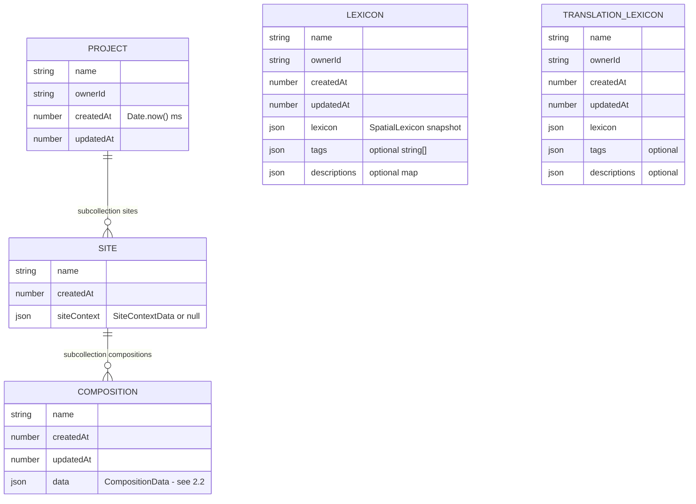
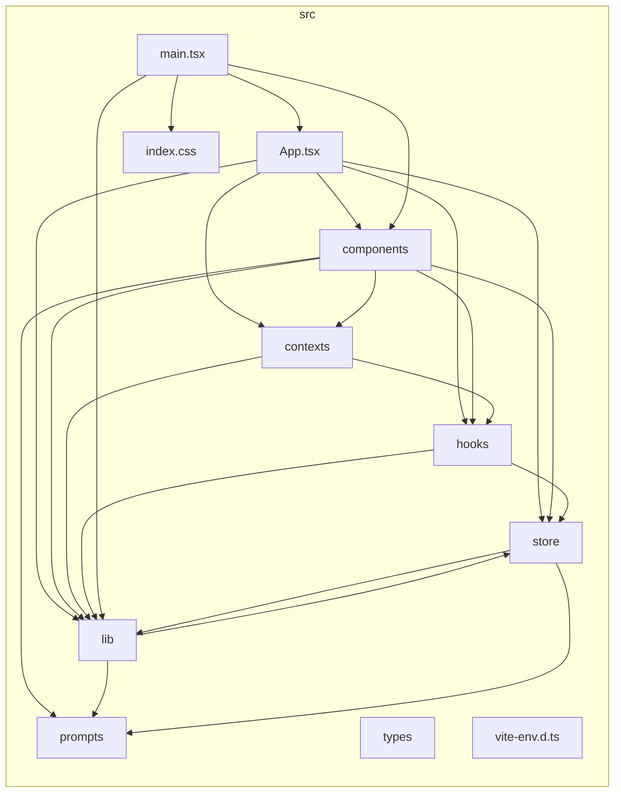
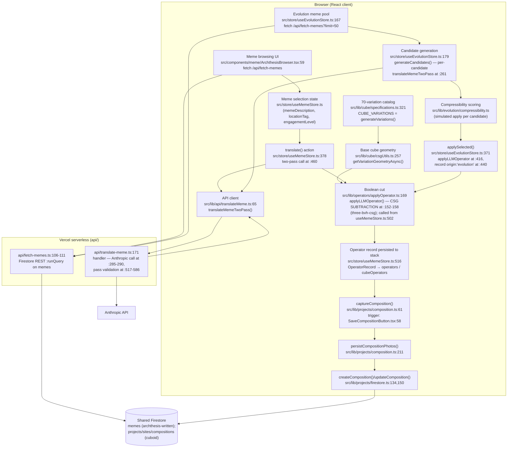

# Structure record — cuboid-studio (Layers 2–3)

Per-repo half of the layered structure record. Layers 0–1 (system map, cross-system contracts)
live in [`docs/SYSTEM-STRUCTURE.md`](docs/SYSTEM-STRUCTURE.md). Every claim cites `file:line` at
the commit under **Extracted**.

---

## Layer 2 — Data schemas

### 2.1 Firestore hierarchy

Cuboid owns five collections in the shared Firebase project — a three-level tree plus two flat
lexicon collections. All shapes below come from `src/lib/projects/types.ts` (the declared doc
types) **and** the write payloads in `src/lib/projects/firestore.ts` /
`lexiconFirestore.ts` / `translationLexiconFirestore.ts`; the write payloads are built from the
same types, so read and write shapes agree by construction (payload cites given per entity).



| Entity | Path | Doc type | Write payload |
|---|---|---|---|
| Project | `projects/{id}` | `ProjectDoc` (`types.ts:200-206`) | `firestore.ts:49` |
| Site | `projects/{id}/sites/{id}` | `SiteDoc` (`types.ts:208-213`) | `firestore.ts:83` |
| Composition | `…/sites/{id}/compositions/{id}` | `CompositionDoc` (`types.ts:215-221`) | `firestore.ts:141` |
| Lexicon | `lexicons/{id}` | `LexiconDoc` | `lexiconFirestore.ts:82-91` |
| Translation lexicon | `translationLexicons/{id}` | `TranslationLexiconDoc` | `translationLexiconFirestore.ts:77-86` |

Access model: all five are owner-scoped (`ownerId`) per the rules. **Note:** this repo's
`firestore.rules` is a *reference copy* — cuboid has no `firebase.json`, so rules are deployed
from the archthesis repo, whose `firestore.rules:89-125` contains the same five collection
blocks (see DRIFT).

The **active site context** additionally lives outside Firestore in `localStorage`
(`src/lib/storage/siteContext.ts:86-96`, shape `SiteContextData` at `siteContext.ts:57-83`:
`site_name`, `generated`, optional `sun_analysis`/`nearby_pois`, `quantitative`
{location, sun, wind, transit, morphology}, `programmatic` {existing_uses, historical_uses}).
It is snapshotted into each composition as `siteContextSnapshot`.

### 2.2 Composition capture / restore

A composition is the complete serializable working state across all modes; live
`THREE.BufferGeometry` is **never stored** — geometry is rebuilt on load by re-applying saved
operator records (`types.ts:9-13`; rebuild at `composition.ts:335`). Captured by
`captureComposition()` (`composition.ts:61`), restored by `restoreComposition()`
(`composition.ts:395`).

`CompositionData` (`types.ts:180-198`) — one slice per mode:

| Slice | Type (all in `types.ts`) | Holds |
|---|---|---|
| `builderAssembly` | `BuilderAssemblyData` (`:36-41`) | `placedCubes: PlacedCube[]`, selection, rule toggles |
| `encode` | `EncodeData \| null` (`:43-100`) | `encodedCubes`, reasoning, mode (`standalone`/`merge`/`remix`), seed cubes, optional `reading`/`readingOriginal`/`readingEdited`, `lexiconSnapshot`+`lexiconId`, `model`, `promptVersion`, `images[]` (240px inline thumbnails + optional Storage path to the full-res original) |
| `pataphysical` | `PataphysicalData` (`:111-130`) | meme inputs (`memeDescription`, `locationTag`, `engagementLevel`, selected meme refs), `passMode`, operator stacks (`operators`, per-cube `cubeOperators`), `lastPass1`/`lastPass2`/`lastConfidenceVector`/`lastModel` |
| `evolution` | `EvolutionData` (`:132-140`) | sub-mode, generation, candidates, compressibility log, config, baseline score |
| `decode` | `DecodeData` (`:159-177`) | canvas tiles, underlay stack (`underlays[]`, legacy single `underlay` read-only), sheet thumbnail |
| `siteContextSnapshot` | `SiteContextData \| null` | site context at save time |
| `savedFromMode` | `AppMode?` | mode to reopen into |
| `captures` | `CaptureRecord[]?` (`:102-109`) | viewport captures — image in Storage, thumbnail + view metadata inline; appended directly onto the stored doc (`firestore.ts:182`), not on the next save |

Recurring size discipline (Firestore ~1 MB/doc): every image field keeps only a ~240px thumbnail
inline and points to Firebase Storage for the original (`types.ts:66-80,98-102,150-162`).

### 2.3 Cube-variation + cutter data model

- **8 master cutters** (`src/lib/cube/specifications.ts:264`, `MASTER_CUTTERS`) defined against a
  42×42×42 cube with origin at the corner (`specifications.ts:9-15`); radii from golden ratio /
  π / primes / harmonic-fifths systems, shell thickness 1.6 (`:16-24`).
- **70 variations = C(8,4)** — every choice of 4 cutters from the 8, lexicographic order to match
  the original Grasshopper script (`specifications.ts:293-320`, `generateVariations`).
  `CubeVariation = { id: "v-00"…"v-69", index, name, cutterIndices, cutters }` (`:285-292`);
  `CUBE_VARIATIONS` at `:321`.
- **Placed cube** (assembly unit): `PlacedCube = { id, variationId, position: [x,y,z], rotation }`
  (`src/lib/cube/types.ts:3-8`).
- **LLM-driven cutter** (the pataphysical cut, distinct from the 8 master cutters):
  `LLMCutterResult = { type: box|sphere|cylinder|plane|taper, proportions, position (normalized
  −1…1), rotation (degrees) }` (`src/lib/operators/types.ts:10-15`).
- **Persisted cut**: `OperatorRecord` (`operators/types.ts:37-69`) — operator class (9 classes in
  v2), targets/magnitude/decay (semantic provenance; **only `cutter` drives geometry**, per the
  type's own comments at `:20-33`), plus optional provenance (`origin`, meme refs, full
  `pass1`/`pass2`/`confidenceVector`, `model`, `promptVersion`).

### 2.4 Two-pass translation payloads

Server: `api/translate-meme.ts` (POST). **Both passes come back from a single model call** — the
model returns `[pass1, pass2]` (array or `{pass1, pass2}` object, `translate-meme.ts:517-526`);
pass 2 consumes pass 1 inside that one prompt chain, not via a second HTTP round-trip.

**Request body** (`translate-meme.ts:182-235`):

| Field | Required | Notes |
|---|---|---|
| `memeDescription` | ✔ | string, ≤ 8 000 chars |
| `locationTag` | | ≤ 256 chars |
| `engagementLevel` | | number, clamped 0–100, default 50 |
| `memeImageUrl` | | forwarded to the model |
| `model` | | default `anthropic/claude-sonnet-4.6` (`:33`) |
| `site_context` | | ≤ 32 KB stringified |
| `pass_mode` | | selects v1 single-pass vs v2 two-pass prompt (`:19,221-228`) |
| `translation_lexicon` | | ≤ 32 KB stringified |

**Pass 1 emits** (`TranslationPass1`, `operators/types.ts:100-111`): `rhetorical_moves: string[]`,
`cultural_tensions: [{description, friction_type: internal|external|both}]`,
`functional_affects: string[]`, `site_resonance: string`, `meme_summary: string`.

**Pass 2 emits** (`TranslationPass2`, `operators/types.ts:113-132`): `operator` (one of 9 v2
classes), `targets: EdgeType[]` + `target_reasoning`, `magnitude`, `decay`,
`cutter` (`LLMCutterResult` + `geometry_reasoning`), `confidence_vector` (4 axes 0–1:
rhetorical_clarity, site_resonance, affective_coherence, operational_specificity,
`types.ts:92-98`), `confidence_note`, `reasoning`. Of all this, **geometry consumes only
`cutter`**; magnitude additionally feeds Evolution's compressibility fingerprint
(`types.ts:26-30`).

Server-side validation enforces every field above (`translate-meme.ts:529-586`) with one
corrective retry on invalid JSON (`:140-155`); still-invalid → HTTP 422 with the raw excerpt
(`:157-161`). Valid → the pass objects plus `promptVersion` when the prompt file declares one
(`:163-168`). Client persists results as `lastPass1`/`lastPass2` in `PataphysicalData` and as
provenance on each `OperatorRecord`.

---

## Layer 3 — Module & flow architecture

### 3.1 Module dependency graph

Generated by dependency-cruiser (exact command under **Regenerate**), collapsed to top-level
folders under `src/`: the uncollapsed module-level graph has 266 edges and is unreadable, so
per the brief it is recorded at folder level. Alias imports (`@/…`) resolve via
`tsconfig.json:18-20`.



Reading notes:

- **`lib` ↔ `store` is a genuine cycle** at folder level. At module level it is broken at
  runtime with dynamic imports — e.g. `useEvolutionStore.ts:219-222` lazily imports
  `useBuilderStore`/`useMemeStore` "to avoid circular deps" (its own comment), and `:395-396`
  lazily imports `applyOperator`/`csgUtils`.
- `types` (i.e. `src/types/archthesis.ts`) shows no in-`src` edges here because its importers
  use type-only imports plus the `api/` serverless functions, which live outside `src/`.
- `prompts` is imported by `lib` and `store` (grammar/lexicon defaults); the translation prompt
  files themselves are read server-side by `api/translate-meme.ts:229-231`.

### 3.2 Hand-traced main pipeline

Meme input → fetch → two-pass translation → boolean cut → variations → composition capture.
Every node names the file (and line) that owns that stage; edges are actual call/data
relationships, verified in code — precision over layout, since this diagram is compared against
an authored section diagram.



Stage-by-stage, with the exact call relationships the edges assert:

1. **Meme input.** `ArchthesisBrowser.tsx:59` fetches `/api/fetch-memes` for browsing;
   `useEvolutionStore.ts:167` fetches the same endpoint for the Evolution meme pool. The server
   function (`api/fetch-memes.ts:106-111`) queries the shared Firestore `memes` collection over
   REST (contract in `docs/SYSTEM-STRUCTURE.md` Layer 1 §2). A selected meme lands in
   `useMemeStore` state.
2. **Two-pass translation.** `useMemeStore.translate()` (`useMemeStore.ts:378`) calls
   `translateMemeTwoPass()` (`src/lib/api/translateMeme.ts:65`, invoked at
   `useMemeStore.ts:460`), which POSTs to `api/translate-meme.ts` (handler at `:171`); the
   server loads the v2 prompt (`:231-232`), calls Anthropic (`:285-290`), and validates both
   passes from the single model response (`:517-586`).
3. **Boolean cut.** The target geometry is the placed cube's variation —
   `getVariationGeometryAsync()` (`csgUtils.ts:257`, used at `useMemeStore.ts:154,371`) over
   `CUBE_VARIATIONS` (`specifications.ts:321`). `applyLLMOperator()`
   (`applyOperator.ts:169`, called at `useMemeStore.ts:502`) builds the cutter from the pass-2
   `cutter` field and subtracts it with three-bvh-csg (`applyOperator.ts:152-158`). The result
   is recorded as an `OperatorRecord` on the standalone or per-cube stack
   (`useMemeStore.ts:516`).
4. **Variations (Evolution).** `generateCandidates()` (`useEvolutionStore.ts:179`) samples the
   meme pool, runs one two-pass translation per candidate (`:261`), simulate-applies each and
   scores compressibility (`src/lib/evolution/compressibility.ts`); `applySelected()` (`:371`)
   applies the chosen candidate through the same `applyLLMOperator` path (`:416`) and appends
   the record with `origin: 'evolution'` (`:440`) into `useMemeStore.cubeOperators`.
5. **Composition capture.** `SaveCompositionButton.tsx:58` (also `ProjectsPanel.tsx:294`,
   `CaptureButton.tsx:160`) calls `captureComposition()` (`composition.ts:61`), which
   serialises every store slice (Layer 2 §2.2); `persistCompositionPhotos()`
   (`composition.ts:211`) moves full-res images to Storage; the document is written by
   `createComposition`/`updateComposition` (`firestore.ts:134,150`) under
   `projects/{p}/sites/{s}/compositions/{c}`.

---

## DRIFT

- **Duplicate rules files, one deployed.** This repo's `firestore.rules:27-63` and archthesis's
  `firestore.rules:89-125` declare the same five cuboid collections; the copies differ only by
  one comment line today (verified by diff). Only archthesis has a `firebase.json` wiring rules
  for deploy — cuboid's copy is reference-only and can silently drift. Flagged, not fixed;
  which copy is authoritative is Iddo's call.
- No `CONTEXT.md` contradictions found at Layer 2 depth: the Projects → Sites → Compositions
  hierarchy, the localStorage site context, and the two-pass flow all match its claims.

## Regenerate

```bash
# Re-verify Layer 2 claims (from the repo root):
sed -n '1,221p' src/lib/projects/types.ts                      # doc + composition types
grep -n "const payload" src/lib/projects/*.ts                  # write payloads
sed -n '280,321p' src/lib/cube/specifications.ts               # 70 variations
sed -n '1,138p' src/lib/operators/types.ts                     # operator + two-pass types
sed -n '176,235p' api/translate-meme.ts                        # request contract
diff <(sed -n '89,125p' ../archthesis/firestore.rules) <(sed -n '27,63p' firestore.rules)

# Regenerate the Layer 3 module graph (exact command used; no repo installs — npx only):
npx --yes --package dependency-cruiser@16 --package typescript@5 depcruise \
  --no-config --ts-config tsconfig.json --output-type mermaid \
  --include-only '^src' --collapse '^src/[^/]+' src
# (Module-level, i.e. the same command without --collapse, yields 266 edges — unreadable;
#  collapsed to folder level per the brief.)

# Re-verify the Layer 3 pipeline trace:
grep -n "fetch-memes" src/components/meme/ArchthesisBrowser.tsx src/store/useEvolutionStore.ts
grep -n "translateMemeTwoPass\|applyLLMOperator\|getVariationGeometryAsync\|const record" src/store/useMemeStore.ts
grep -n "generateCandidates\|applySelected\|translateMemeTwoPass\|origin: 'evolution'" src/store/useEvolutionStore.ts
grep -n "captureComposition()" -r src/components
```

## Extracted

Extracted 2026-08-30 against cuboid-studio `a4fe78a` (cross-references: map-context `1ae8f6c`,
archthesis `625ea8d`).
