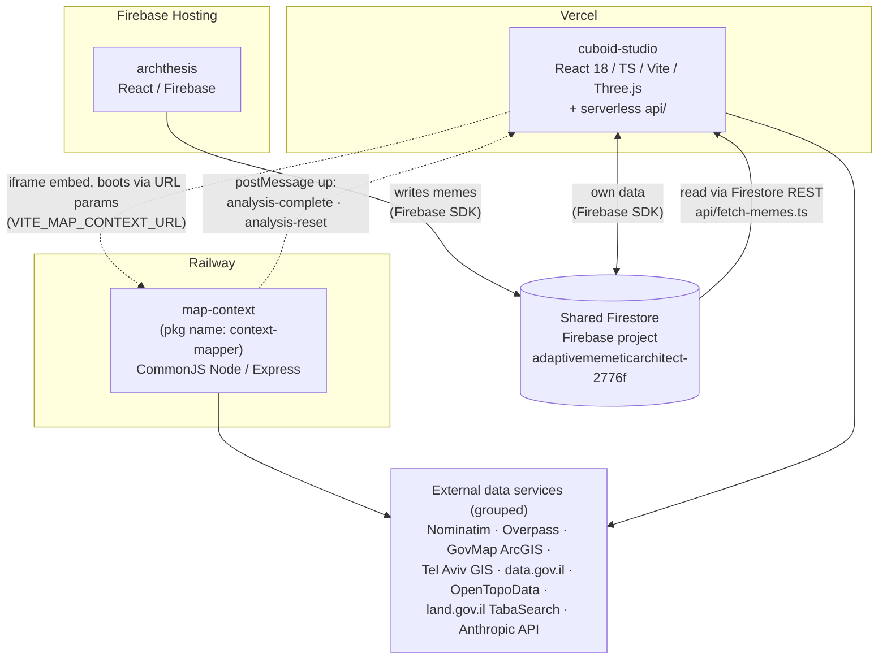

# System structure record — cross-system (Layers 0–1)

Text-first structure record for the three systems: **cuboid-studio**, **map-context**, **archthesis**.
The markdown is the source of truth; diagrams are Mermaid blocks rendered from this file, never
hand-maintained. Every claim cites `file:line` in one of the three repos at the commits listed
under **Extracted**.

- Layers 0–1 (this file): system map + cross-system contracts.
- Layers 2–3: per-repo `STRUCTURE.md` at the root of each repo — `cuboid-studio/STRUCTURE.md`,
  `map-context/STRUCTURE.md`, `archthesis/STRUCTURE.md` *(not yet written; next layers)*.

The three codebases are three separate repositories (the planned workspace merge did not happen):
`iddonaim/cuboid-studio`, `iddonaim/map-context`, `iddonaim/archthesis`.

---

## Layer 0 — System map

The three systems, their deploy targets, the two coupling mechanisms (drawn as distinct edge
types), and external data services as one grouped node. Not exhaustive — the seams only.

**Edge legend:** solid arrows = data coupling through shared Firestore; dotted arrows = the
iframe/postMessage embedding; thin solid arrows to the grouped node = outbound HTTP calls to
external services.



### Citations

Every node and edge above, sourced from code (paths are repo-relative; repo prefixed):

**Systems and stacks**

| Claim | Source |
|---|---|
| cuboid-studio = React 18 / TS / Vite / Three.js + serverless `api/` | `cuboid-studio/package.json` (deps `react`, `three`, `vite`); `cuboid-studio/api/` directory (`fetch-memes.ts`, `translate-meme.ts`, `encode-space.ts`, `geocode.ts`, `fetch-context-pois.ts`, `fetch-meme-by-id.ts`) |
| map-context = CommonJS Node/Express, package name `context-mapper` | `map-context/package.json` (`"main": "index.js"`, `"start": "node launcher.js"`, dep `express`) |
| archthesis = React/Firebase | `archthesis/package.json`; `archthesis/firebase.json` |

**Deploy targets**

| Claim | Source |
|---|---|
| cuboid-studio → Vercel | `cuboid-studio/vercel.json` (Vite build config); `cuboid-studio/api/fetch-memes.ts:1` imports `@vercel/node` types |
| map-context → Railway | `map-context/README.md:70` ("run on hosts like Railway as-is"); `map-context/launcher.js:297` (Railway comment); consumed at `https://map-context-production.up.railway.app` — `cuboid-studio/src/components/map/MapContextCanvas.tsx:17` (`DEFAULT_MAP_CONTEXT_URL`) and `cuboid-studio/.env.example:17`. No Railway config file exists in the map-context repo itself — the Railway deployment is attested from the consumer side and comments only. |
| archthesis → Firebase Hosting | `archthesis/firebase.json` (`"hosting"` block, `"public": "dist"`) |

**Coupling mechanism 1 — shared Firestore (archthesis ↔ cuboid)**

| Claim | Source |
|---|---|
| archthesis writes the `memes` collection | `archthesis/src/hooks/usePublishMeme.ts:156` (`addDoc(collection(db, 'memes'), memeData)`) |
| cuboid reads `memes` via Firestore REST (no SDK, no admin key) | `cuboid-studio/api/fetch-memes.ts:23-25` (`PROJECT_ID = 'adaptivememeticarchitect-2776f'`, `FIRESTORE_URL = https://firestore.googleapis.com/v1/projects/…`) |
| cuboid's own client also talks to the same Firebase project (its own data) | `cuboid-studio/src/lib/firebase.ts:41` (`initializeApp`); `cuboid-studio/.env.example:29` (`VITE_FIREBASE_PROJECT_ID=adaptivememeticarchitect-2776f`) |
| archthesis targets the project via env vars, not hard-coded | `archthesis/.env.example:4` is a placeholder (`your_project_id`); the concrete ID appears in archthesis docs (`README.md`, `docs/FIREBASE_SETUP_GUIDE.md`), not in its code |

**Coupling mechanism 2 — iframe + postMessage (cuboid ↔ map-context)**

| Claim | Source |
|---|---|
| cuboid embeds map-context in an iframe at `VITE_MAP_CONTEXT_URL` | `cuboid-studio/src/components/map/MapContextCanvas.tsx:97` (env read), `:17` (Railway default) |
| downward direction is URL boot params on the iframe src, not postMessage | `cuboid-studio/src/components/map/MapContextCanvas.tsx` (`buildMapContextSrc(mapContextUrl, getActiveSiteContext())` sets `iframeSrc`) |
| upward: map-context posts `analysis-complete` | `map-context/launcher.js:219` (dashboard fires it), `:591-592` (launcher relays it to `window.parent`); received with origin enforcement at `cuboid-studio/src/components/map/MapContextCanvas.tsx:27,34` |
| upward: map-context posts `analysis-reset` (contract grew since June) | `map-context/launcher.js:810`; handled at `cuboid-studio/src/components/map/MapContextCanvas.tsx:46` |

**External data services (grouped node)**

| Service | Called from |
|---|---|
| Nominatim (geocoding) | `map-context/index.js:34,1375`; `map-context/launcher.js:87,166`; `cuboid-studio/api/geocode.ts:34` |
| Overpass (OSM features) | `map-context/index.js:63-64`; `map-context/atlas.js:95-96`; `cuboid-studio/api/fetch-context-pois.ts:34` |
| GovMap ArcGIS | `map-context/index.js:391` (`GOVMAP_BASE`) |
| Tel Aviv GIS | `map-context/index.js:392` (`TELAVIV_MAPSVR`) |
| data.gov.il | `map-context/index.js:1056` (`DATAGOV_BASE`) |
| OpenTopoData (elevation) | `map-context/index.js:1494` |
| land.gov.il TabaSearch | `map-context/index.js:654-655`; `map-context/lib/tabaDocs.js:42` |
| Anthropic API (translation LLM) | `cuboid-studio/api/translate-meme.ts:285-290` |

---

## Layer 1 — Contracts (the seams)

*Not yet extracted. Next layer boundary — resumes here: (1) archthesis → Firestore write shapes,
(2) `/api/fetch-memes` query + response type, diffed against (1), (3) cuboid ↔ map-context
postMessage payloads both directions, (4) map-context OBJ/SVG export contracts.*

---

## DRIFT

Deltas found while extracting (claim → what the repo shows). Flagged, not fixed.

- **Handoff brief (Step 0 footer, 2026-08-30):** "shared project `adaptivememeticarchitect-2776f`
  in both `.env.example`s" → the ID is in `cuboid-studio/.env.example:29` but **not** in
  `archthesis/.env.example` (placeholder `your_project_id` at line 4). Archthesis carries the
  concrete ID only in docs (`README.md`, `docs/FIREBASE_SETUP_GUIDE.md`); cuboid additionally
  hard-codes it in `api/fetch-memes.ts:23`. Same shared project either way — only the *location*
  of the evidence differs from the brief.
- No `cuboid-studio/CONTEXT.md` contradictions surfaced at Layer 0 depth (deploy targets, iframe
  URL/env var, and the two postMessage types all match). CONTEXT.md claims below Layer 0 were not
  yet checked.

## Regenerate

```bash
# Render the Mermaid block(s) in this file to SVG (read-only, via npx):
npx -y @mermaid-js/mermaid-cli -i docs/SYSTEM-STRUCTURE.md -o docs/SYSTEM-STRUCTURE.svg

# Re-verify Layer 0 claims (run from the directory holding all three repos):
grep -n "DEFAULT_MAP_CONTEXT_URL\|VITE_MAP_CONTEXT_URL" cuboid-studio/src/components/map/MapContextCanvas.tsx
grep -n "analysis-complete\|analysis-reset" map-context/launcher.js cuboid-studio/src/components/map/MapContextCanvas.tsx
grep -n "adaptivememeticarchitect" cuboid-studio/.env.example cuboid-studio/api/fetch-memes.ts
grep -n "'memes'" archthesis/src/hooks/usePublishMeme.ts
grep -rnE "nominatim|overpass|govmap|tel-aviv|data\.gov\.il|opentopodata|land\.gov\.il" map-context/index.js cuboid-studio/api/*.ts
```

## Extracted

Extracted 2026-08-30 against:

| Repo | Commit |
|---|---|
| cuboid-studio | `a4fe78a` |
| map-context | `1ae8f6c` |
| archthesis | `625ea8d` |
