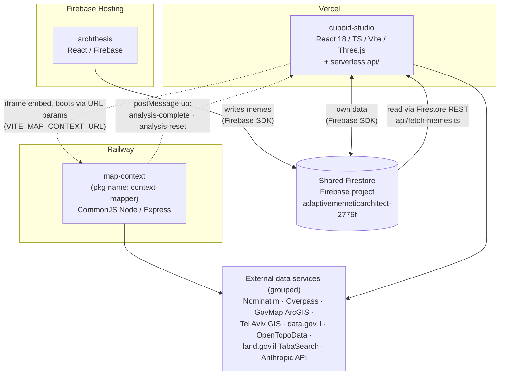

# System structure record — cross-system (Layers 0–1)

Text-first structure record for the three systems: **cuboid-studio**, **map-context**, **archthesis**.
The markdown is the source of truth; diagrams are Mermaid blocks rendered from this file, never
hand-maintained. Every claim cites `file:line` in one of the three repos at the commits listed
under **Extracted**.

- Layers 0–1 (this file): system map + cross-system contracts.
- Layers 2–3: per-repo `STRUCTURE.md` at the root of each repo — `cuboid-studio/STRUCTURE.md`,
  `map-context/STRUCTURE.md`, `archthesis/STRUCTURE.md` *(not yet written; next layers)*.

The three codebases are three separate repositories (the planned workspace merge did not happen):
`iddonaim/cuboid-studio`, `iddonaim/map-context`, `iddonaim/archthesis`.

---

## Layer 0 — System map

The three systems, their deploy targets, the two coupling mechanisms (drawn as distinct edge
types), and external data services as one grouped node. Not exhaustive — the seams only.

**Edge legend:** solid arrows = data coupling through shared Firestore; dotted arrows = the
iframe/postMessage embedding; thin solid arrows to the grouped node = outbound HTTP calls to
external services.



### Citations

Every node and edge above, sourced from code (paths are repo-relative; repo prefixed):

**Systems and stacks**

| Claim | Source |
|---|---|
| cuboid-studio = React 18 / TS / Vite / Three.js + serverless `api/` | `cuboid-studio/package.json` (deps `react`, `three`, `vite`); `cuboid-studio/api/` directory (`fetch-memes.ts`, `translate-meme.ts`, `encode-space.ts`, `geocode.ts`, `fetch-context-pois.ts`, `fetch-meme-by-id.ts`) |
| map-context = CommonJS Node/Express, package name `context-mapper` | `map-context/package.json` (`"main": "index.js"`, `"start": "node launcher.js"`, dep `express`) |
| archthesis = React/Firebase | `archthesis/package.json`; `archthesis/firebase.json` |

**Deploy targets**

| Claim | Source |
|---|---|
| cuboid-studio → Vercel | `cuboid-studio/vercel.json` (Vite build config); `cuboid-studio/api/fetch-memes.ts:1` imports `@vercel/node` types |
| map-context → Railway | `map-context/README.md:70` ("run on hosts like Railway as-is"); `map-context/launcher.js:297` (Railway comment); consumed at `https://map-context-production.up.railway.app` — `cuboid-studio/src/components/map/MapContextCanvas.tsx:17` (`DEFAULT_MAP_CONTEXT_URL`) and `cuboid-studio/.env.example:17`. No Railway config file exists in the map-context repo itself — the Railway deployment is attested from the consumer side and comments only. |
| archthesis → Firebase Hosting | `archthesis/firebase.json` (`"hosting"` block, `"public": "dist"`) |

**Coupling mechanism 1 — shared Firestore (archthesis ↔ cuboid)**

| Claim | Source |
|---|---|
| archthesis writes the `memes` collection | `archthesis/src/hooks/usePublishMeme.ts:156` (`addDoc(collection(db, 'memes'), memeData)`) |
| cuboid reads `memes` via Firestore REST (no SDK, no admin key) | `cuboid-studio/api/fetch-memes.ts:23-25` (`PROJECT_ID = 'adaptivememeticarchitect-2776f'`, `FIRESTORE_URL = https://firestore.googleapis.com/v1/projects/…`) |
| cuboid's own client also talks to the same Firebase project (its own data) | `cuboid-studio/src/lib/firebase.ts:41` (`initializeApp`); `cuboid-studio/.env.example:29` (`VITE_FIREBASE_PROJECT_ID=adaptivememeticarchitect-2776f`) |
| archthesis targets the project via env vars, not hard-coded | `archthesis/.env.example:4` is a placeholder (`your_project_id`); the concrete ID appears in archthesis docs (`README.md`, `docs/FIREBASE_SETUP_GUIDE.md`), not in its code |

**Coupling mechanism 2 — iframe + postMessage (cuboid ↔ map-context)**

| Claim | Source |
|---|---|
| cuboid embeds map-context in an iframe at `VITE_MAP_CONTEXT_URL` | `cuboid-studio/src/components/map/MapContextCanvas.tsx:97` (env read), `:17` (Railway default) |
| downward direction is URL boot params on the iframe src, not postMessage | `cuboid-studio/src/components/map/MapContextCanvas.tsx` (`buildMapContextSrc(mapContextUrl, getActiveSiteContext())` sets `iframeSrc`) |
| upward: map-context posts `analysis-complete` | `map-context/launcher.js:219` (dashboard fires it), `:591-592` (launcher relays it to `window.parent`); received with origin enforcement at `cuboid-studio/src/components/map/MapContextCanvas.tsx:27,34` |
| upward: map-context posts `analysis-reset` (contract grew since June) | `map-context/launcher.js:810`; handled at `cuboid-studio/src/components/map/MapContextCanvas.tsx:46` |

**External data services (grouped node)**

| Service | Called from |
|---|---|
| Nominatim (geocoding) | `map-context/index.js:34,1375`; `map-context/launcher.js:87,166`; `cuboid-studio/api/geocode.ts:34` |
| Overpass (OSM features) | `map-context/index.js:63-64`; `map-context/atlas.js:95-96`; `cuboid-studio/api/fetch-context-pois.ts:34` |
| GovMap ArcGIS | `map-context/index.js:391` (`GOVMAP_BASE`) |
| Tel Aviv GIS | `map-context/index.js:392` (`TELAVIV_MAPSVR`) |
| data.gov.il | `map-context/index.js:1056` (`DATAGOV_BASE`) |
| OpenTopoData (elevation) | `map-context/index.js:1494` |
| land.gov.il TabaSearch | `map-context/index.js:654-655`; `map-context/lib/tabaDocs.js:42` |
| Anthropic API (translation LLM) | `cuboid-studio/api/translate-meme.ts:285-290` |

---

## Layer 1 — Contracts (the seams)

Four contracts, each with the exact shape from code. Firestore is schemaless, so §1 (writes) and
§2 (reads) are derived independently and then diffed — the mismatch table in §2 is the
highest-value output of this layer.

### 1. archthesis → Firestore (write side)

archthesis writes exactly **two collections**: `memes` and `contact_messages` (all write sites
found by grepping `addDoc|setDoc|updateDoc|deleteDoc|increment` across `archthesis/src`). The
meme image itself goes to Firebase **Storage** at `memes/{memeId}.jpg` before the Firestore write
(`usePublishMeme.ts:124-133`), and `imageUrl` is the resulting download URL. A `templates`
collection is declared in `firestore.rules:40-46` ("future use") but no code reads or writes it.

**`memes` document — the create shape** (`archthesis/src/hooks/usePublishMeme.ts:136-156`,
`addDoc` at `:156`):

| Field | Type as written | Notes |
|---|---|---|
| `imageUrl` | string | Storage download URL |
| `memeText` | string | combined text of all non-placeholder text boxes, `''` if none (`:43-48,138`) |
| `description` | string | `''` if empty |
| `tags` | string[] | |
| `location` | object \| **null** | `{ latitude: number, longitude: number, display_name: string, showInGallery: boolean, hideFromGallery: boolean }` (`:141-147`) |
| `username` | string | `''` if empty |
| `likes` | number | always `0` at create (rules enforce this, `firestore.rules:23`) |
| `hidden` | boolean | always `false` at create |
| `timestamp` | Firestore server timestamp | `serverTimestamp()` |
| `createdAt` | string | client ISO date, `new Date().toISOString()` |
| `originSource` | string | QR-tracking origin from `localStorage`, default `'link'` |

**Later mutations of `memes`:**

| Mutation | Fields touched | Source |
|---|---|---|
| like/unlike | `likes: increment(±1)` | `MemeCard.tsx:46-48`; `Lightbox.tsx:52-54` |
| admin hide/show | `hidden` | `MemeManagementTable.tsx:65-67` |
| admin delete | whole doc (+ Storage object) | `MemeManagementTable.tsx:86` |

Rules (`archthesis/firestore.rules:16-37`): public read (`allow read: if true`, `:18`);
anonymous create with length guards on `imageUrl`/`topText`/`bottomText`/`memeText`/
`description`/`username`/`tags` (`:21-29` — note the rules still guard `topText`/`bottomText`
even though current code never writes them); non-admin update may touch **only** `likes` (`:32-33`).

**`contact_messages` document — create shape** (`archthesis/src/components/common/ContactModal.tsx:35-43`):
`{ name: string, email: string, message: string, source: string, timestamp: serverTimestamp,`
`createdAt: ISO string, status: 'unread' }`. Admin later sets `status: 'read'`
(`ContactMessagesTable.tsx:79-81`) or deletes (`:69`). Admin-only read (`firestore.rules:55-64`).
This collection is archthesis-internal — cuboid never reads it.

### 2. Firestore → cuboid (`/api/fetch-memes` read side)

`cuboid-studio/api/fetch-memes.ts` — a Vercel function calling the **Firestore REST API**
directly (`:runQuery`, `:106-111`), authenticated only by the public Firebase web API key
(`:24`); access works because of archthesis's `allow read: if true` rule, not the key.

**Query** (`fetch-memes.ts:88-103`): `structuredQuery` on collection `memes`; `orderBy createdAt DESC`
(default; `likes DESC` for `sort=popular`, `createdAt ASC` for `sort=oldest`, `:84-86`); optional
`tags ARRAY_CONTAINS` filter (`:95-103`); Firestore-side `limit = offset + limit + 10`.
Then **post-query in JS**: drop `hidden` memes (`:124`), optional text search across
`memeText/topText/bottomText/description/username/location.display_name/tags` (`:127-137`),
count-based pagination slice (`:139-140`).

**Response** (`:142`): `FetchMemesResponse = { memes: ArchthesisMeme[], hasMore: boolean }`
(`cuboid-studio/src/types/archthesis.ts:32-36`). Per-meme fields extracted in `docToMeme`
(`fetch-memes.ts:48-70`): `id` (from the document name), `imageUrl`, `topText`, `bottomText`,
`memeText`, `description`, `tags`, `location`, `username`, `likes`, `timestamp` (⭠ `createdAt`,
falling back to `timestamp`), `userId`, `hidden`, `originSource`.

Sibling endpoint `api/fetch-meme-by-id.ts` returns `{ meme, cuboidInput }` where `cuboidInput`
pre-maps the meme for the translation pipeline: `memeDescription` (joined text fields),
`locationTag` (`location.display_name`), `engagementLevel` (log-scale of `likes`, 0–100,
`likesToEngagement` at `:34-38`, mapping at `:96-101`).

**Read/write diff — the findings.** Recorded, not fixed:

| # | Finding | Write side | Read side | Effect |
|---|---|---|---|---|
| 1 | `topText`/`bottomText` are read but **never written** by current publish code | absent from `memeData` (`usePublishMeme.ts:136-154`); still guarded in rules (`firestore.rules:24-25`) and required in archthesis's own `Meme` type (`src/types/meme.ts:4-5`) — i.e. legacy fields from an older publish shape | extracted with `'' ` default (`fetch-memes.ts:57-58`); declared **required** in `ArchthesisMeme` (`archthesis.ts:17-18`) | every meme published by current code arrives in cuboid with empty `topText`/`bottomText`; only legacy docs carry them |
| 2 | `userId` is read but **no write site sets it** anywhere in archthesis | no occurrence outside reads/types | `fetch-memes.ts:67`; `archthesis.ts:27` | always `undefined` unless legacy docs carry it |
| 3 | ordering field vs. legacy docs | current code always writes `createdAt` | query orders by `createdAt` (`fetch-memes.ts:84-91`); Firestore `orderBy` **excludes documents missing the field** | any legacy doc without `createdAt` is silently invisible to `/api/fetch-memes`. Whether such docs exist is a **data** question — unknown, not checkable from code |
| 4 | `location` shape understated | written with 5 keys incl. `showInGallery`/`hideFromGallery` (`usePublishMeme.ts:141-147`); archthesis's own type also allows a **legacy string** form (`src/types/meme.ts:9`) | cuboid's `ArchthesisMemeLocation` declares only `latitude`/`longitude`/`display_name` (`archthesis.ts:8-12`), but `extractValue` passes whatever is stored | no data loss at runtime; the TS type under-describes the wire shape, and a legacy string-location would violate it |
| 5 | `timestamp` is synthesized | two fields written: `timestamp` (server ts) + `createdAt` (client ISO string) | response `timestamp` = `createdAt` first, `timestamp` as fallback (`fetch-memes.ts:66`) | field named `timestamp` in the response is actually the **client-side** ISO string when present |

### 3. cuboid ↔ map-context (iframe + postMessage)

**Embed**: `VITE_MAP_CONTEXT_URL` (`MapContextCanvas.tsx:96-99`), default
`https://map-context-production.up.railway.app` (`:17`).

**Downward (cuboid → map-context) — no postMessage exists in this direction.** The only
downward channel is iframe **URL boot params** `?lat&lon&address&r` set when cuboid has an
active located site (`cuboid-studio/src/lib/siteContext/mapContextUrl.ts:70-79`: lat/lon at 6
decimals, `r` rounded integer metres; parsed by map-context in `launcher.js` / `parseSiteParams`).
Site identity for "same site" checks is rounded 4-decimal lat/lng + radius
(`mapContextUrl.ts:44-50`), matching map-context's server-side result-cache key.

**Upward (map-context → cuboid) — exactly two message types.** All are posted with wildcard
target origin (`'*'`); cuboid filters by `event.origin === origin(VITE_MAP_CONTEXT_URL)`
(`MapContextCanvas.tsx:127-129`). `launcher.js` is the only postMessage sender in map-context
(grep over `index.js`/`launcher.js`/`atlas.js`).

1. **`analysis-complete`** — `{ type: 'analysis-complete', data: <runAnalysis data> }`.
   Fired by a script the launcher injects into the finished dashboard HTML
   (`map-context/launcher.js:216-220`), then relayed from the nested srcdoc iframe up to
   `window.parent` (= cuboid) at `launcher.js:582-592`. The `data` payload is the object built
   at `map-context/index.js:3054-3075`:

   | Field | Shape | Source line |
   |---|---|---|
   | `site_center` | `{ lat, lon }` | `index.js:3055` |
   | `site_radius` | number (m) | `:3056` |
   | `address` | string | `:3057` |
   | `layerSources` | `{ buildings, trees, registration, streets }` — provider name or `"none"` | `:3037-3042` |
   | `elevation` | number \| null | `:3059` |
   | `buildings`, `streets`, `trees`, `institutions`, `registration` | GeoJSON FeatureCollections | `:3060-3064` |
   | `transit` | `{ lightrail, train }` GeoJSON FCs | `:3065-3068` |
   | `demographics` | CBS data \| null (null when deferred) | `:3069` |
   | `demographicsUrl` | string \| null — `/cbs-data?lat&lon` to poll when deferred | `:3070-3072` |
   | `taba` | plan data \| null | `:3073` |

   Cuboid types this as `MapAnalysisPayload` (`mapContextPayload.ts:38-53`) and **adapts** it
   into a summarized `SiteContextData` before storing (`MapContextCanvas.tsx:60-84` —
   the raw GeoJSON is distilled into POIs + morphology, never persisted; localStorage/Firestore
   size is the stated reason, `mapContextPayload.ts:11-15`).
   *Contract diff, both benign:* the actual payload's `demographicsUrl` is **absent from
   cuboid's type** (ignored at runtime); cuboid's type has a `quantitative` field map-context
   **never posts** (explicitly documented future-proofing, `mapContextPayload.ts:33-37`).

2. **`analysis-reset`** — `{ type: 'analysis-reset' }`, no payload. Posted when the user hits
   the dashboard's "new analysis" button (`launcher.js:810`). Cuboid resets the iframe src to
   the bare picker URL and drops the attached site (`MapContextCanvas.tsx:41-48,130-139`).

### 4. map-context export contracts (SVG / OBJ)

Both exports are generated **in the browser** by inline script in the dashboard HTML that
`index.js` templates — nothing is written server-side; the files arrive as Blob downloads via a
temporary `<a download>` (`dl()` at `index.js:2562-2568`).

Shared coordinate frame (both formats): local tangent-plane metres centred on `SITE_CENTER`,
equirectangular approximation with R = 6 378 137 m, stated valid for radii < 5 km
(`index.js:2301-2311` for SVG, `:2473-2480` for OBJ). **Units: 1 unit = 1 metre** in both
(`:2359`, `:2457`). Only layers whose dashboard toggle is on are exported.

| | SVG | OBJ |
|---|---|---|
| Filename | `context_mapper_export.svg` (`index.js:2412`) | `context_mapper_3d.obj` + companion `context_mapper_3d.mtl` (`:2570-2571`) |
| Axes | x = east; **y flipped, north = negative y** (SVG screen convention, `:2309`) | x = east, y = north (no flip, `:2479`), z = up |
| Content | 2D features; layer names preserved as SVG group IDs, "import directly into Rhino — no rescaling" (`:2088,2395-2398`) | closed meshes per building (walls + roof), streets as polylines, trees as vertical line stubs (`:2457`) |
| Heights | — | `feature.properties.height`, defaulting to **9.6 m** when absent (`:2493`; server gap-fills heights from OSM `building:levels` before that, `:457,486`) |
| Materials | — | `.mtl` with named materials `buildings`/`streets`/`trees` (`:2555-2559`) |

---

## DRIFT

Deltas found while extracting (claim → what the repo shows). Flagged, not fixed.

- **Handoff brief (Step 0 footer, 2026-08-30):** "shared project `adaptivememeticarchitect-2776f`
  in both `.env.example`s" → the ID is in `cuboid-studio/.env.example:29` but **not** in
  `archthesis/.env.example` (placeholder `your_project_id` at line 4). Archthesis carries the
  concrete ID only in docs (`README.md`, `docs/FIREBASE_SETUP_GUIDE.md`); cuboid additionally
  hard-codes it in `api/fetch-memes.ts:23`. Same shared project either way — only the *location*
  of the evidence differs from the brief.
- No `cuboid-studio/CONTEXT.md` contradictions surfaced at Layer 0 depth (deploy targets, iframe
  URL/env var, and the two postMessage types all match). CONTEXT.md claims below Layer 0 were not
  yet checked.
- **Layer 1:** no new CONTEXT.md contradictions found at contract depth. The read/write and
  type-vs-wire mismatches found (legacy `topText`/`bottomText`/`userId`; `createdAt` ordering vs
  legacy docs; `location` shape; `demographicsUrl` missing from `MapAnalysisPayload`) are
  code-vs-code findings, recorded inline in Layer 1 §2–§3 — they are not CONTEXT.md drift.
- **Cuboid code-comment claim → wire truth:** `mapContextPayload.ts:33-37` says
  `MapAnalysisPayload` is "the shape map-context actually posts" — the actual payload also
  carries `demographicsUrl` (`map-context/index.js:3070-3072`). Harmless (ignored), flagged only.

## Regenerate

```bash
# Render the Mermaid block(s) in this file to SVG (read-only, via npx):
npx -y @mermaid-js/mermaid-cli -i docs/SYSTEM-STRUCTURE.md -o docs/SYSTEM-STRUCTURE.svg

# Re-verify Layer 0 claims (run from the directory holding all three repos):
grep -n "DEFAULT_MAP_CONTEXT_URL\|VITE_MAP_CONTEXT_URL" cuboid-studio/src/components/map/MapContextCanvas.tsx
grep -n "analysis-complete\|analysis-reset" map-context/launcher.js cuboid-studio/src/components/map/MapContextCanvas.tsx
grep -n "adaptivememeticarchitect" cuboid-studio/.env.example cuboid-studio/api/fetch-memes.ts
grep -n "'memes'" archthesis/src/hooks/usePublishMeme.ts
grep -rnE "nominatim|overpass|govmap|tel-aviv|data\.gov\.il|opentopodata|land\.gov\.il" map-context/index.js cuboid-studio/api/*.ts

# Re-verify Layer 1 claims:
grep -rnE "addDoc|setDoc|updateDoc|deleteDoc|increment\(" archthesis/src --include=*.ts --include=*.tsx   # all write sites
sed -n '136,156p' archthesis/src/hooks/usePublishMeme.ts                                                  # memes create shape
sed -n '80,145p' cuboid-studio/api/fetch-memes.ts                                                         # query + response
sed -n '3054,3075p' map-context/index.js                                                                  # analysis-complete payload
grep -n "postMessage" map-context/launcher.js map-context/index.js map-context/atlas.js                   # message inventory
sed -n '2300,2320p;2471,2500p;2550,2575p' map-context/index.js                                            # SVG/OBJ export contracts
```

## Extracted

Extracted 2026-08-30 against:

| Repo | Commit |
|---|---|
| cuboid-studio | `a4fe78a` |
| map-context | `1ae8f6c` |
| archthesis | `625ea8d` |
